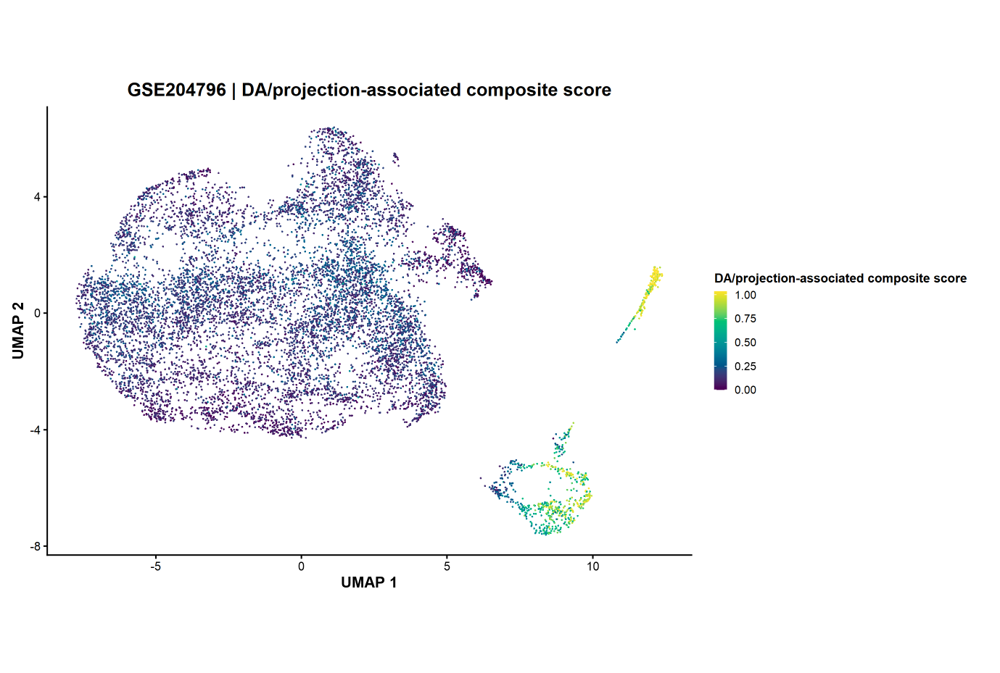
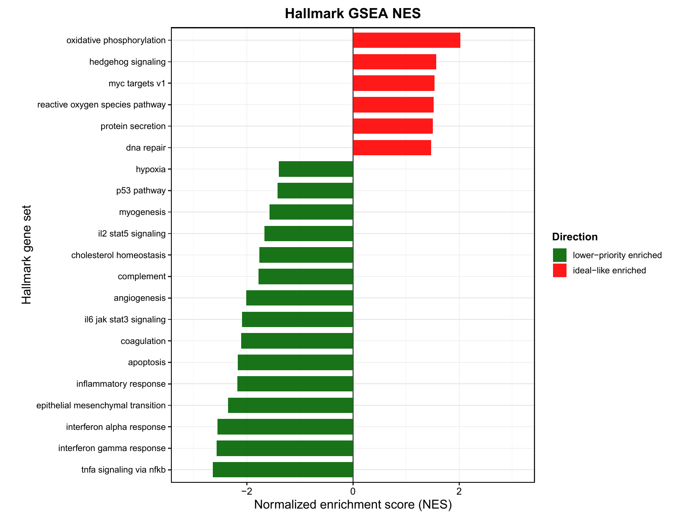
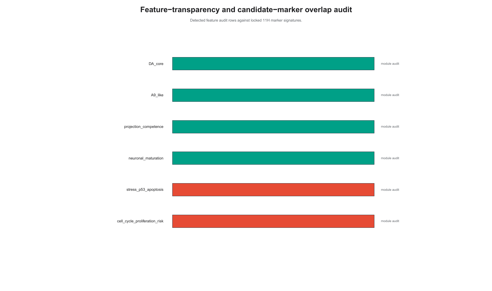
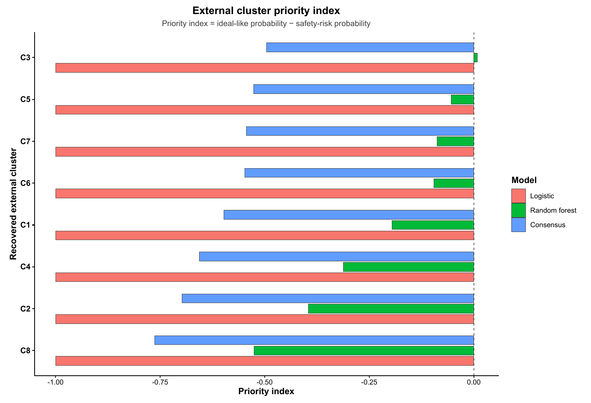
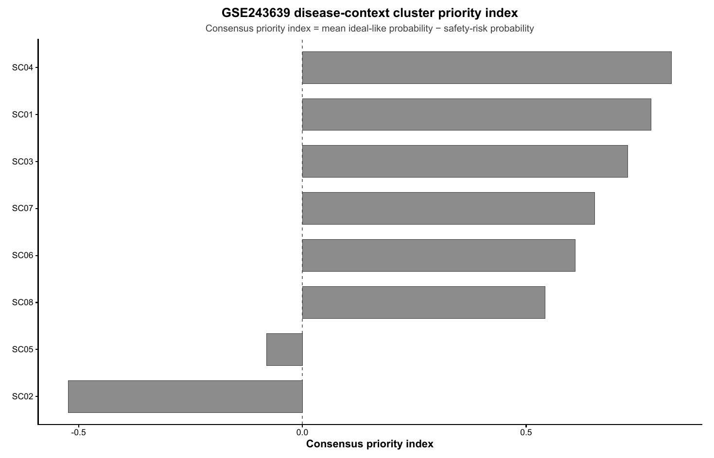

# DA neuron / graft-related transcriptomic cell-state prioritisation framework

A source-traceable computational transcriptomic framework for prioritising candidate dopaminergic neuron and graft-related cell states by jointly evaluating functional identity, maturation-related evidence and risk-associated transcriptional programmes.

**Public-facing model label:** marker-rule-derived prioritisation model.

## Scientific question

Dopaminergic marker expression alone does not prove that a candidate cell state has the desired combination of dopaminergic identity, projection-associated molecular competence, maturation-related support and a favourable risk-associated transcriptomic profile. This repository provides a reproducible prioritisation framework for ranking candidate transcriptomic cell states and marker signatures for downstream experimental interpretation.

## Visual overview


## Selected figure highlights

Selected low-resolution previews are embedded for quick browsing. Click any preview to open the full PDF.

### Public Figure 006

[](figures/12O_final_integrated_package/01_main_single_panel/006_main_10D_V18_main_single_panel_Figure_01_F1B_Representative_discovery-dat.pdf)

**Category:** Main UMAP

Final annotation-colour UMAP display selected for GitHub.

### DA/projection molecular score

[](figures/12O_final_integrated_package/01_main_single_panel/007_main_10D_V18_main_single_panel_Figure_02_F1C_DA_projection-associated_mol.pdf)

**Category:** Main evidence

Projection-associated molecular competence and DA-related score evidence.

### Safety-risk transcriptional score

[](figures/12O_final_integrated_package/01_main_single_panel/008_main_10D_V18_main_single_panel_Figure_03_F1D_Safety-risk-associated_trans.pdf)

**Category:** Main evidence

Risk-associated transcriptional programmes used by the prioritisation framework.

### Candidate-state signature heatmap

[](figures/12O_final_integrated_package/01_main_single_panel/010_main_10D_V18_main_single_panel_Figure_05_F2A_Candidate-state_signature_he.pdf)

**Category:** Main evidence

Candidate-state marker/signature support across retained transcriptomic states.

### Pathway / enrichment evidence

[](figures/12O_final_integrated_package/01_main_single_panel/014_main_10D_V18_main_single_panel_Figure_09_F2E_Hallmark_GSEA_10D_V18_single.pdf)

**Category:** Pathway evidence

GO/KEGG/Hallmark enrichment evidence supporting transcriptomic interpretation.

### ROC/PR/AUC performance audit

[](figures/12O_final_integrated_package/02_ml_audit_required_ROC_PR_AUC/031_ml_auc_11J_ML_audit_ROC_PR_AUC_11J_FINAL_FigB_ROC_PR_performance_audit.pdf)

**Category:** ML audit

Required machine-learning audit figure documenting ROC/PR/AUC checks.

### Feature-importance / marker-overlap audit

[](figures/12O_final_integrated_package/02_ml_audit_required_ROC_PR_AUC/032_ml_auc_11J_ML_audit_ROC_PR_AUC_11J_FINAL_FigC_feature_importance_marker_o.pdf)

**Category:** ML audit

Audits whether model features overlap with marker-rule-derived evidence.

### External validation support

[](figures/12O_final_integrated_package/01_main_single_panel/022_main_10D_V18_main_single_panel_Figure_17_F4C_GSE183248_external_priority_.pdf)

**Category:** External validation

External/contextual transcriptomic support for the prioritisation output.

### Disease-context support

[](figures/12O_final_integrated_package/01_main_single_panel/029_main_10D_V18_main_single_panel_Figure_24_F5E_GSE243639_context_priority_i.pdf)

**Category:** Disease-context support

Disease-context transcriptomic evidence supporting candidate-state interpretation.

## What this repository contains

- Reproducible R analysis scripts.
- Source manifests and provenance tables.
- Dataset metadata and audit files supporting source traceability.
- Final GitHub-facing integrated figure package.
- Required ROC/PR/AUC machine-learning audit figures.
- Claim-boundary and no-overclaim audit materials.
- English and Chinese public project summaries.

This repository does not redistribute raw GEO data, large intermediate R objects, private local files, or submission-system-only materials.

## Final figure package

The final public figure package is stored in `figures/12O_final_integrated_package`.

Retained figure groups:

- `01_main_single_panel`: 24 PDF files
- `02_ml_audit_required_ROC_PR_AUC`: 4 PDF files
- `03_publication_panel_package`: 145 PDF files
- `04_supplementary_supporting_evidence`: 10 PDF files
- `05_audit_boundary_reproducibility`: 18 PDF files

Total retained public PDF files detected: 201.

`06_optional_context_not_for_strong_claims` is intentionally excluded from the public-facing package.

## Public Figure 006

Public Figure 006 uses the final annotation-colour UMAP display selected for GitHub. The plot does not show cluster numbers, n, maj or majority percentages; the right-side legend explains what each colour represents.

[Open public Figure 006](figures/12O_final_integrated_package/01_main_single_panel/006_main_10D_V18_main_single_panel_Figure_01_F1B_Representative_discovery-dat.pdf)

## Machine-learning audit

The `02_ml_audit_required_ROC_PR_AUC` folder is intentionally retained. These figures document ROC/PR/AUC-related model-performance checks and feature/marker-overlap audits. They support auditability of the marker-rule-derived prioritisation framework; they do not establish a clinical prediction model.

## Repository structure

```text
docs/          manuscript-facing notes or explanatory documents
figures/       public figure package, overview graphics, annotation guide and manifests
metadata/      dataset metadata and provenance-supporting files
scripts/       reproducible analysis and figure-generation scripts
tables/        public tables and manifest-style outputs
README.md      English public summary
README_zh.md   Chinese public summary
```

## Traceability files

- Public short-filename mapping: `figures/manifests/12P_V4_github_public_figure_filename_mapping.csv`
- Figure annotation table: `figures/manifests/12P_V4_github_public_figure_annotation_table.csv`
- Readable figure guide: `figures/ANNOTATED_FIGURE_GUIDE.md`

## Interpretation boundary

### Supported interpretation

- Source-traceable computational transcriptomic prioritisation framework.
- Candidate transcriptomic cell-state prioritisation.
- Candidate marker-signature and module-score support.
- Marker-rule-derived prioritisation model audit.
- External/contextual evidence support at the transcriptomic level.

### Not claimed

- Clinical-use prediction.
- Patient outcome prediction.
- Therapeutic-response prediction.
- Validated diagnostic, prognostic or therapeutic biomarker discovery.
- Graft efficacy or clinical safety prediction.
- Anatomical-projection proof.
- Barcode-confirmed lineage tracing.
- Genetic causality or disease-mechanism proof.

## Reproducibility

Raw public datasets should be obtained from their original repositories. This GitHub package focuses on scripts, metadata, manifests, traceability records and selected public-facing result figures required to understand and audit the computational workflow.

## Language

A Chinese summary is available in [README_zh.md](README_zh.md).
