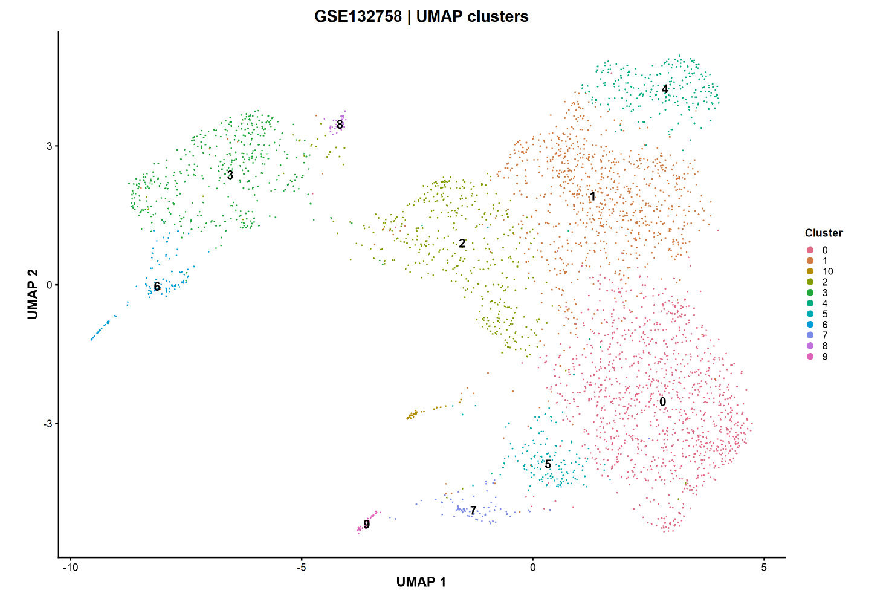
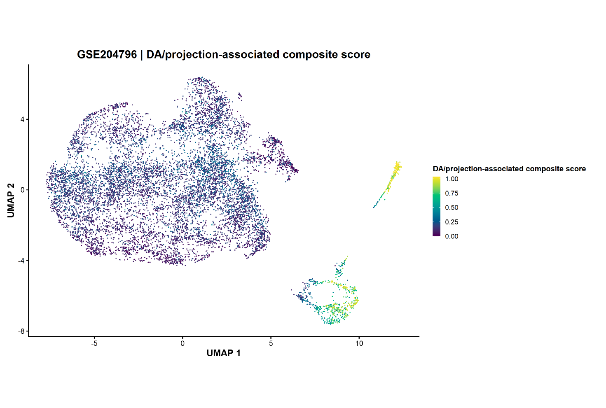
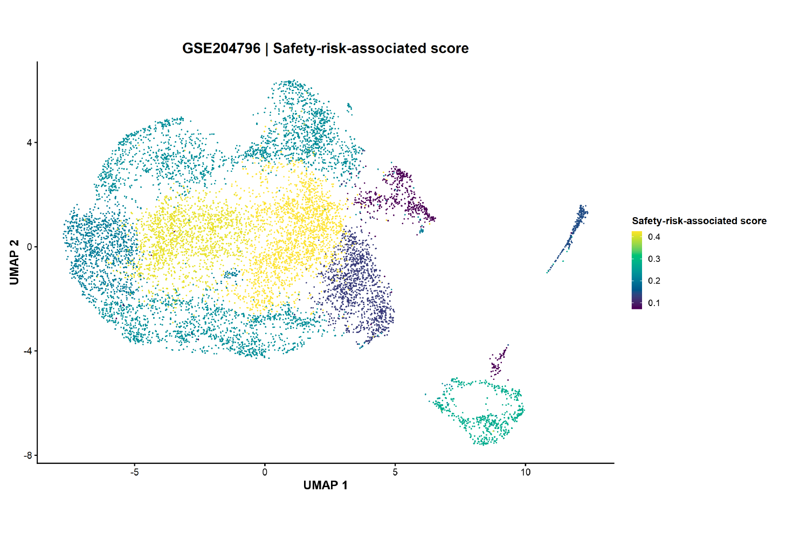
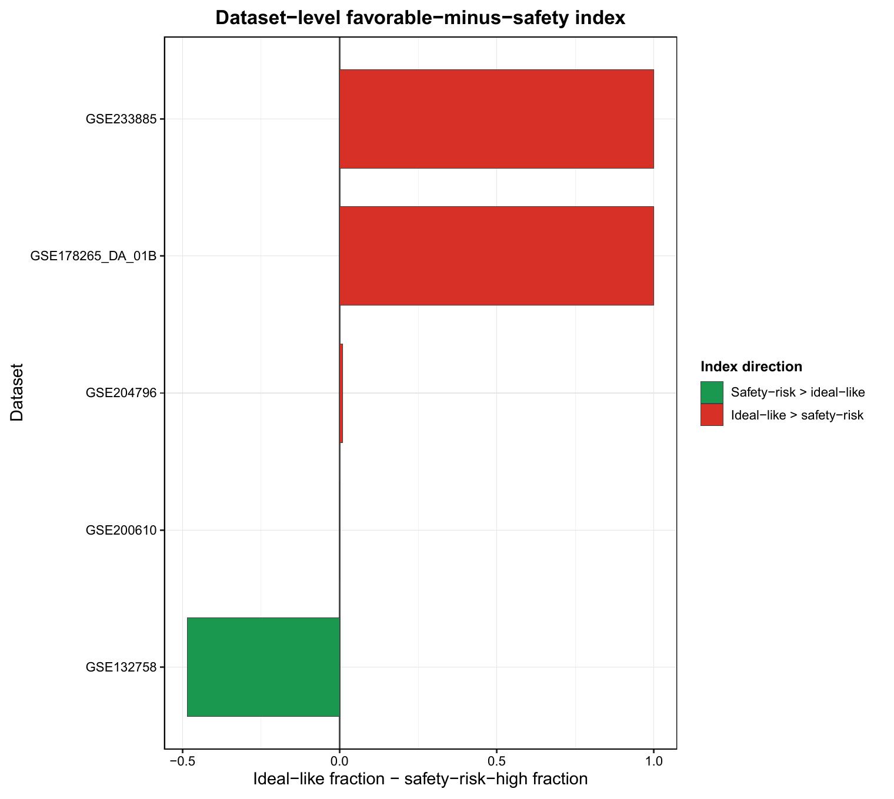
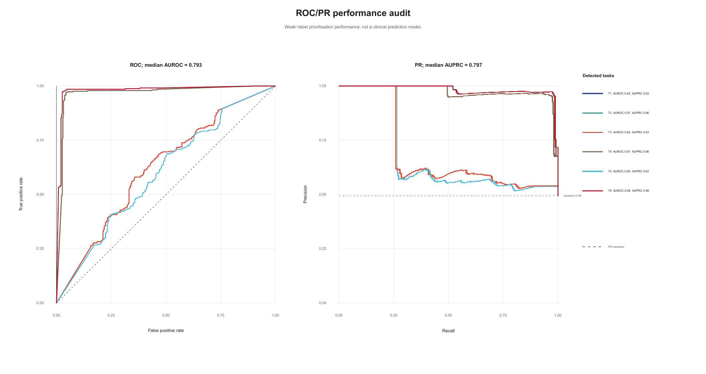
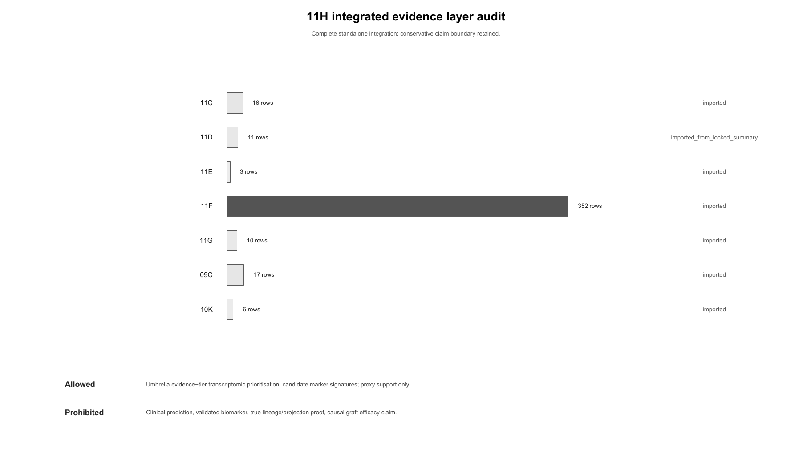

# DA neuron / graft-related transcriptomic cell-state prioritisation framework

A source-traceable computational framework for prioritising candidate dopaminergic neuron and graft-related transcriptomic cell states by jointly evaluating functional identity, maturation-related evidence and risk-associated transcriptional programmes.

**Public-facing model label:** marker-rule-derived prioritisation model.

## Visual overview

### Selected figure previews

## Final figure package

This repository display is based on the **12O final integrated figure package** generated after the 12N no-overclaim audit. The GitHub-facing figure package uses short public filenames for Windows/GitHub compatibility while preserving traceability through `figures/manifests/12P_V3_github_public_figure_filename_mapping.csv`.

Figure files are stored under:

- `figures/12O_final_integrated_package/01_main_single_panel/`
- `figures/12O_final_integrated_package/02_ml_audit_required_ROC_PR_AUC/`
- `figures/12O_final_integrated_package/03_publication_panel_package/`
- `figures/12O_final_integrated_package/04_supplementary_supporting_evidence/`
- `figures/12O_final_integrated_package/05_audit_boundary_reproducibility/`
- `figures/12O_final_integrated_package/06_optional_context_not_for_strong_claims/`

### Figure counts

- `01_main_single_panel`: 24 PDF files
- `02_ml_audit_required_ROC_PR_AUC`: 4 PDF files
- `03_publication_panel_package`: 145 PDF files
- `04_supplementary_supporting_evidence`: 10 PDF files
- `05_audit_boundary_reproducibility`: 18 PDF files
- `06_optional_context_not_for_strong_claims`: 11 PDF files

## Scientific question

Dopaminergic marker expression alone does not establish that a candidate cell state combines appropriate functional identity, maturation-related competence and a favourable risk-associated transcriptional profile. This project creates a transparent cross-dataset prioritisation layer to identify candidate states and marker signatures for subsequent experimental testing.

## Framework

1. Curate public transcriptomic datasets and source provenance.
2. quantify DA-like, A9/A10-like and projection-associated molecular competence programmes.
3. quantify proliferation, progenitor, immaturity, stress and related risk-associated programmes.
4. assign marker-rule-derived candidate-state priority structure.
5. audit robustness using threshold sensitivity, negative controls, feature-leakage checks, leave-one-dataset-out evaluation and external-dataset assessment.
6. integrate candidate marker signatures, evidence tiers and reproducibility records.

## Required ML audit

The `02_ml_audit_required_ROC_PR_AUC` folder is intentionally retained. It includes the ROC/PR/AUC-related model-performance audit and feature-importance/marker-overlap checks. These figures support auditability of the marker-rule-derived prioritisation structure; they do **not** establish clinical prediction.

## Core outputs

- candidate transcriptomic cell-state prioritisation;
- identity-risk evidence maps;
- candidate transcriptomic marker signatures;
- pseudotime and maturation-related support;
- negative-control, sensitivity and cross-dataset assessment outputs;
- source manifests, provenance tables and claim-boundary materials.

## Core datasets

Core workflow datasets include `GSE178265`, `GSE132758`, `GSE200610`, `GSE204795`, `GSE204796`, `GSE233885` and `GSE157783`.

Independent/context assessment datasets include `GSE183248` and `GSE243639`. Dataset roles and source details are recorded in `metadata/` and the provenance documents.

## Interpretation boundary

### Supported interpretation

- source-traceable computational transcriptomic prioritisation framework;
- candidate transcriptomic cell states and marker signatures;
- marker-rule-derived prioritisation model audit;
- pseudotime/module-score support;
- proxy and contextual evidence support.

### Not claimed

- clinical-use prediction;
- validated diagnostic, prognostic or therapeutic biomarkers;
- graft efficacy, patient outcome or clinical safety prediction;
- anatomical-projection proof;
- barcode-confirmed lineage tracing;
- genetic causality or disease-mechanism proof.

## Reproducibility and data availability

Raw GEO data and large intermediate R objects are not redistributed. They should be obtained from the original public repositories. This public package provides scripts, source manifests, metadata, provenance tables, selected result-support materials and the final 12O-integrated figure package.

## Language

A Chinese project summary is available in [README_zh.md](README_zh.md).
