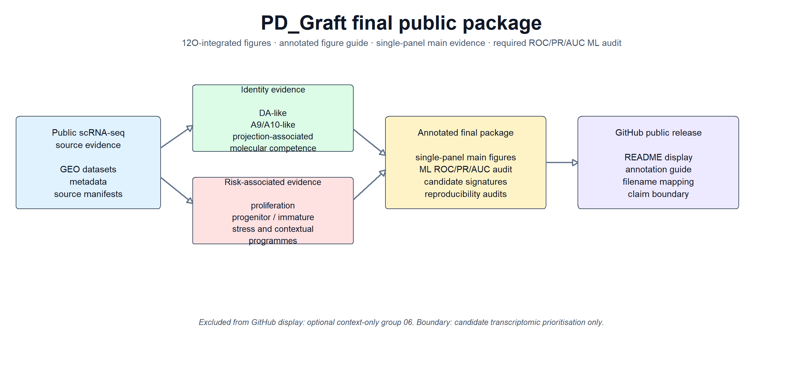
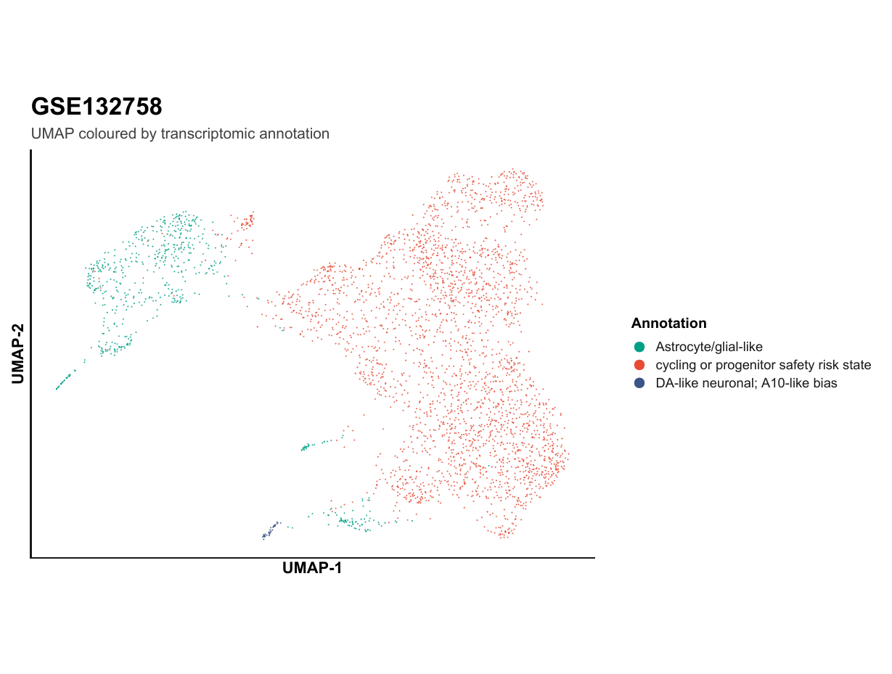
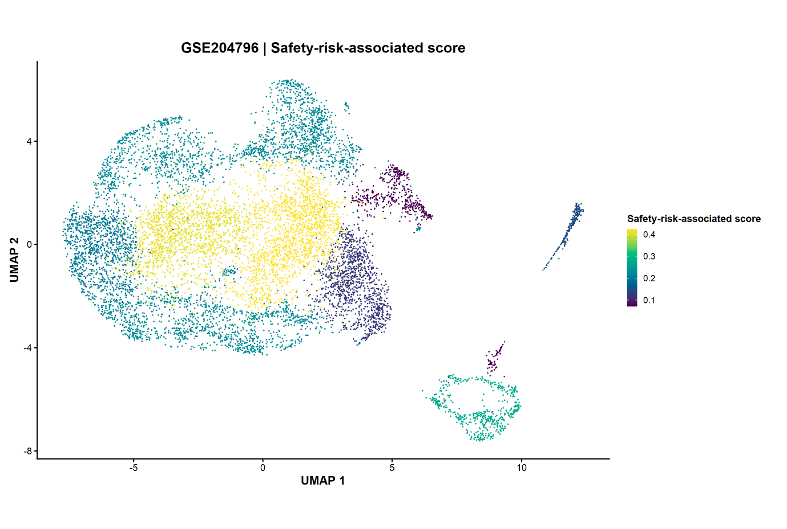
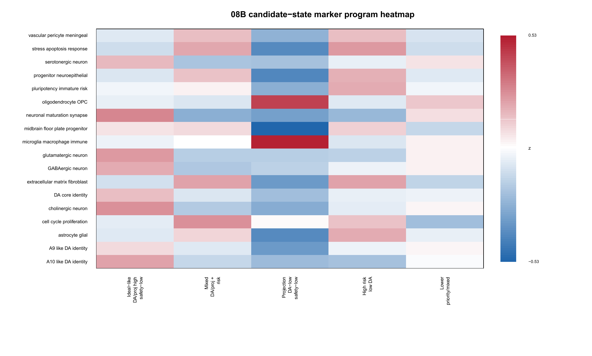
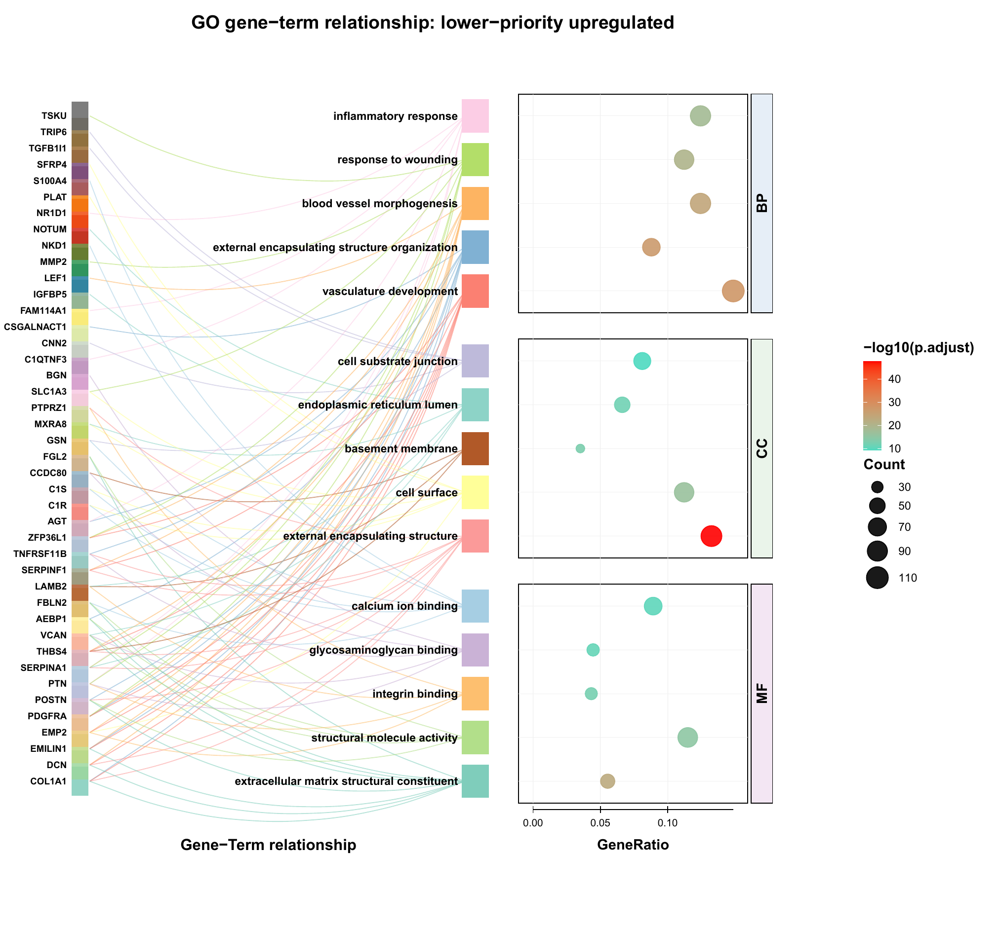
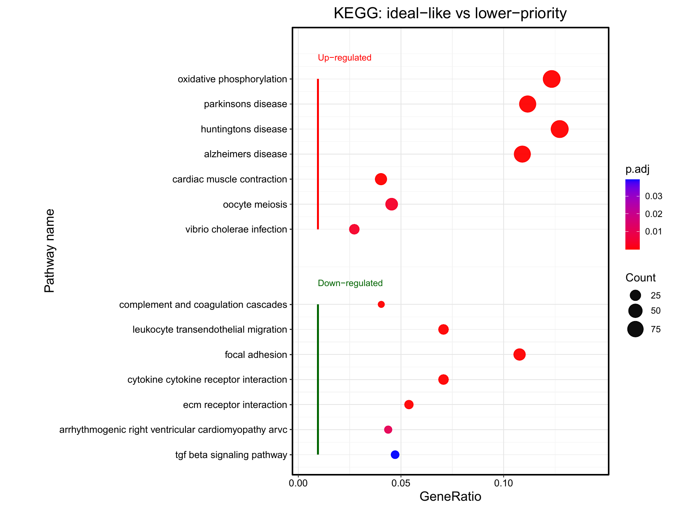
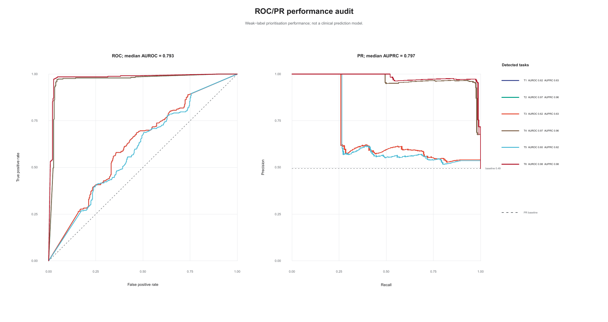

# DA neuron / graft-related transcriptomic cell-state prioritisation framework

这是一个可追溯来源的计算转录组框架，用于通过联合评估功能身份、成熟相关证据和风险相关转录程序，对候选多巴胺能神经元及移植物相关细胞状态进行优先级排序。

**对外公开模型名称：** marker-rule-derived prioritisation model。

## 科学问题

仅凭多巴胺能 marker 表达，并不能证明某个候选细胞状态同时具备理想的多巴胺能身份、projection-associated molecular competence、成熟相关支持以及较为有利的 risk-associated transcriptomic profile。本仓库提供了一个可复现的优先级排序框架，用于对候选转录组细胞状态和 marker signature 进行排序，供后续实验解释参考。

## 可视化总览



## 精选图顺序展示

下面的精选图严格按照要求的实验顺序展示：**UMAP -> Safety-risk-associated score -> Heatmap -> GO -> KEGG -> Hallmark -> ROC/PR/AUC performance audit**。

### 1. UMAP

按注释着色的 UMAP，总览候选多巴胺能 / 移植物相关细胞状态，作为实验流程的第一张图。



[打开 PDF](figures/12O_final_integrated_package/01_main_single_panel/006_main_10D_V18_main_single_panel_Figure_01_F1B_Representative_discovery-dat.pdf)

### 2. Safety-risk-associated score

评分图，展示候选细胞状态中的 safety-risk-associated 转录程序分布。



[打开 PDF](figures/12O_final_integrated_package/01_main_single_panel/008_main_10D_V18_main_single_panel_Figure_03_F1D_Safety-risk-associated_trans.pdf)

### 3. Heatmap

候选细胞状态 signature heatmap，总结 marker-rule-derived 转录组结构。



[打开 PDF](figures/12O_final_integrated_package/01_main_single_panel/010_main_10D_V18_main_single_panel_Figure_05_F2A_Candidate-state_signature_he.pdf)

### 4. Gene Ontology (GO)

GO 富集图，展示优先候选细胞状态关联的功能主题。



[打开 PDF](figures/12O_final_integrated_package/01_main_single_panel/012_main_10D_V18_main_single_panel_Figure_07_F2C_Gene_Ontology_enrichment_10D.pdf)

### 5. KEGG

KEGG 富集图，将优先候选状态连接到通路层面的生物学背景。



[打开 PDF](figures/12O_final_integrated_package/01_main_single_panel/013_main_10D_V18_main_single_panel_Figure_08_F2D_KEGG_enrichment_10D_V18_sing.pdf)

### 6. Hallmark

Hallmark GSEA 图，用于总结优先级框架的高层级程序支持。


[打开 PDF](figures/12O_final_integrated_package/01_main_single_panel/014_main_10D_V18_main_single_panel_Figure_09_F2E_Hallmark_GSEA_10D_V18_single.pdf)

### 7. ROC / PR / AUC performance audit

机器学习审计图，展示 ROC / PR / AUC 相关性能检查；按要求放在实验顺序最后。



[打开 PDF](figures/12O_final_integrated_package/02_ml_audit_required_ROC_PR_AUC/031_ml_auc_11J_ML_audit_ROC_PR_AUC_11J_FINAL_FigB_ROC_PR_performance_audit.pdf)

## 仓库包含内容

- 可复现的 R 分析脚本。
- 来源清单与 provenance 表。
- 支撑 source traceability 的数据集 metadata 与审计文件。
- 面向 GitHub 的最终整合 figure package。
- 必需保留的 ROC/PR/AUC 机器学习审计图。
- claim boundary 与 no-overclaim 审计材料。
- 英文与中文公开项目摘要。

本仓库不重新分发原始 GEO 数据、大型中间 R 对象、私有本地文件或仅供投稿系统使用的材料。

## 最终图包

最终公开图包存放在 `figures/12O_final_integrated_package`。

保留的图组如下：

- `01_main_single_panel`：24 个 PDF
- `02_ml_audit_required_ROC_PR_AUC`：4 个 PDF
- `03_publication_panel_package`：145 个 PDF
- `04_supplementary_supporting_evidence`：10 个 PDF
- `05_audit_boundary_reproducibility`：18 个 PDF

检测到保留的公开 PDF 总数：201。

`06_optional_context_not_for_strong_claims` 已按设计从公开图包中排除。

## 仓库结构

```text
docs/        面向手稿的说明性文档
figures/     公共图包、overview 图、annotation guide 与 manifests
metadata/    数据集 metadata 与 provenance 支撑文件
scripts/     可复现分析与作图脚本
tables/      对外公开表格与 manifest 风格输出
README.md    英文公开摘要
README_zh.md 中文公开摘要
```

## 可追溯文件

- 公共短文件名映射：`figures/manifests/12P_V4_github_public_figure_filename_mapping.csv`
- 图注释表：`figures/manifests/12P_V4_github_public_figure_annotation_table.csv`
- 可读图指南：`figures/ANNOTATED_FIGURE_GUIDE.md`

## 解释边界

### 支持的解释

- 可追溯来源的计算转录组优先级框架。
- 候选转录组细胞状态优先级排序。
- 候选 marker-signature 与 module-score 支持。
- marker-rule-derived prioritisation model 审计。
- 转录组层面的外部 / 情境支持证据。

### 不主张的内容

- 临床用途预测。
- 患者结局预测。
- 治疗反应预测。
- 已验证的诊断 / 预后 / 治疗 biomarker 发现。
- 解剖投射层面的证明。
- 条形码谱系追踪层面的证明。
- 遗传因果或疾病机制层面的证明。

## 公开说明

该公开版本重点用于 source traceability、透明的图导航，以及对计算优先级框架进行谨慎解释。
