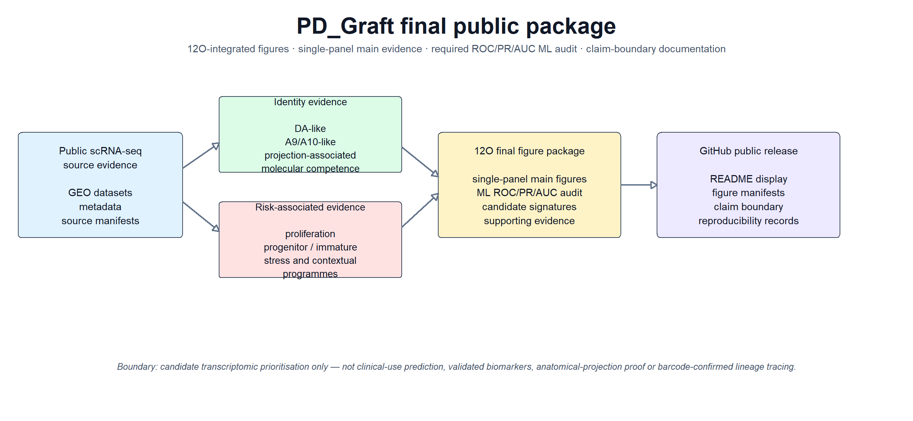

# 多巴胺能神经元／移植物相关转录组候选细胞状态优先级框架

本仓库提供一个来源可追溯的计算转录组框架，通过同时评估功能身份、成熟相关证据与风险相关转录程序，对多巴胺能神经元及移植物相关候选细胞状态进行优先级排序。

**公开模型名称：** marker-rule-derived prioritisation model（标志物规则衍生的优先级模型）。

## 项目总览

## 最终图片包

当前 GitHub 展示基于 **12O final integrated figure package**。12O 是在 12N no-overclaim audit 之后生成的最终图片整合包，包含最新单图版主图、必需的 ROC/PR/AUC 机器学习审计图、投稿图包、支持证据以及结论边界和可重复性材料。

GitHub 版本使用短文件名，避免 Windows 路径过长。原始 12O 文件名与公开短文件名的对应关系见：

`figures/manifests/12P_V3_github_public_figure_filename_mapping.csv`

图片位于：

- `figures/12O_final_integrated_package/01_main_single_panel/`
- `figures/12O_final_integrated_package/02_ml_audit_required_ROC_PR_AUC/`
- `figures/12O_final_integrated_package/03_publication_panel_package/`
- `figures/12O_final_integrated_package/04_supplementary_supporting_evidence/`
- `figures/12O_final_integrated_package/05_audit_boundary_reproducibility/`
- `figures/12O_final_integrated_package/06_optional_context_not_for_strong_claims/`

### 图片数量

- `01_main_single_panel`：24 个 PDF
- `02_ml_audit_required_ROC_PR_AUC`：4 个 PDF
- `03_publication_panel_package`：145 个 PDF
- `04_supplementary_supporting_evidence`：10 个 PDF
- `05_audit_boundary_reproducibility`：18 个 PDF
- `06_optional_context_not_for_strong_claims`：11 个 PDF

## 要解决的问题

单纯表达多巴胺能标志物，并不能证明一个候选细胞状态同时具有合适的功能身份、成熟／投射相关分子能力以及较低的风险相关转录特征。本项目建立一个透明、可审计、跨数据集的计算优先级层，为后续湿实验、分选方案和功能验证缩小候选范围。

## 必需的 ML 审计图

`02_ml_audit_required_ROC_PR_AUC` 文件夹必须保留。它包含 ROC/PR/AUC 性能审计和 feature-importance/marker-overlap 检查。这些图用于支持模型审计和可解释性，但不能解释为临床预测已经成立。

## 结论边界

本项目支持“候选转录组状态优先级”和“候选 marker signature”层面的解释，但不声称：

- 临床预测或患者结局预测；
- 已验证的诊断、预后或治疗 biomarker；
- 已证明的移植物疗效或临床安全性；
- 真实解剖投射；
- barcode 确认的谱系追踪；
- 遗传因果或疾病机制证明。

英文主说明见 [README.md](README.md)。
