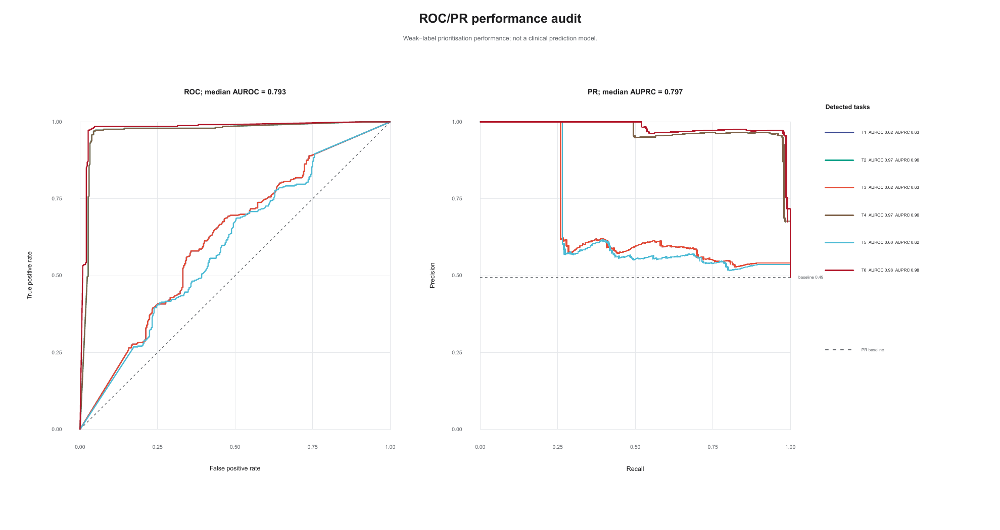

# Figures

This directory contains the GitHub-facing final figure package together with manifests, overview graphics and README preview PNGs.

## Selected figure highlights

The selected highlights follow the experimental workflow order: **UMAP -> Safety-risk-associated score -> Heatmap -> GO -> KEGG -> Hallmark -> ROC/PR/AUC performance audit**.

Each preview is linked to the corresponding full-resolution PDF in the final figure package.

### 1. UMAP

**What this figure shows:** This panel provides the entry point for the transcriptomic landscape. It places cells in a two-dimensional UMAP space and uses the final annotation-colour display to show how broad candidate cell-state programmes are distributed across the discovery dataset.

It helps readers immediately see the relationship between the major annotated states before moving into score-based, marker-based and pathway-level evidence.

[Open full PDF](12O_final_integrated_package/01_main_single_panel/006_main_10D_V18_main_single_panel_Figure_01_F1B_Representative_discovery-dat.pdf)

### 2. Safety-risk-associated score

**What this figure shows:** This panel visualises the safety-risk-associated transcriptional score across the same cell-state landscape. It shows where risk-linked programmes, including proliferative, progenitor-like, immature or stress-associated transcriptional patterns, are concentrated.

Placed directly after the UMAP, it connects spatial cell-state organisation with the risk-aware layer of the prioritisation model.

[Open full PDF](12O_final_integrated_package/01_main_single_panel/008_main_10D_V18_main_single_panel_Figure_03_F1D_Safety-risk-associated_trans.pdf)

### 3. Heatmap

**What this figure shows:** This heatmap summarises the marker-rule-derived signature structure across candidate states. It provides a compact view of how selected identity, maturation and risk-associated gene programmes vary across the prioritised transcriptomic groups.

The heatmap acts as the bridge between single-cell spatial patterns and the gene-level evidence used to define the prioritisation framework.

[Open full PDF](12O_final_integrated_package/01_main_single_panel/010_main_10D_V18_main_single_panel_Figure_05_F2A_Candidate-state_signature_he.pdf)

### 4. Gene Ontology (GO)

**What this figure shows:** The GO enrichment panel translates the marker/signature layer into functional biological terms. It summarises the biological processes and cellular programmes associated with the prioritised candidate states.

This provides a functional interpretation layer after the heatmap, helping readers move from gene lists to organised biological themes.

[Open full PDF](12O_final_integrated_package/01_main_single_panel/012_main_10D_V18_main_single_panel_Figure_07_F2C_Gene_Ontology_enrichment_10D.pdf)

### 5. KEGG

**What this figure shows:** The KEGG panel places the candidate-state gene evidence into curated pathway context. It highlights pathway-level structure that complements the GO biological-process view.

Together with GO, this panel helps organise the prioritised transcriptomic signal into interpretable pathway modules.

[Open full PDF](12O_final_integrated_package/01_main_single_panel/013_main_10D_V18_main_single_panel_Figure_08_F2D_KEGG_enrichment_10D_V18_sing.pdf)

### 6. Hallmark

**What this figure shows:** The Hallmark panel condenses enrichment evidence into higher-order transcriptional programmes. It provides a broad programme-level summary that complements the more detailed GO and KEGG views.

This figure helps show whether the candidate-state evidence aligns with coherent transcriptional programmes rather than isolated gene-level changes.

[Open full PDF](12O_final_integrated_package/01_main_single_panel/014_main_10D_V18_main_single_panel_Figure_09_F2E_Hallmark_GSEA_10D_V18_single.pdf)

### 7. ROC / PR / AUC performance audit

**What this figure shows:** The ROC/PR/AUC audit panel summarises the model-performance layer of the workflow. It shows how the weak-label machine-learning component separates the marker-rule-defined comparison tasks and provides an audit trail for the prioritisation model.

Placed last, this figure completes the sequence from cell-state visualisation, to signature evidence, to pathway interpretation, and finally to model-performance auditing.

[Open full PDF](12O_final_integrated_package/02_ml_audit_required_ROC_PR_AUC/031_ml_auc_11J_ML_audit_ROC_PR_AUC_11J_FINAL_FigB_ROC_PR_performance_audit.pdf)

## Figure package root

- Final public figure package: `12O_final_integrated_package`
- Preview PNG directory: `selected_highlights_preview_png`

## Traceability files

- Public short-filename mapping: `figures/manifests/12P_V4_github_public_figure_filename_mapping.csv`
- Figure annotation table: `figures/manifests/12P_V4_github_public_figure_annotation_table.csv`
- Readable figure guide: `figures/ANNOTATED_FIGURE_GUIDE.md`

## Claim boundary

These figures support candidate transcriptomic cell-state prioritisation only. They do not establish clinical prediction, validated biomarkers, anatomical projection proof, barcode-confirmed lineage tracing or genetic causality.
